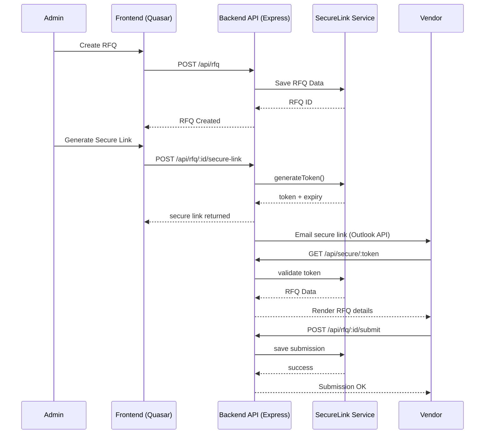

# RFQ System - TKMR

A comprehensive Request for Quotation (RFQ) system for TKMR, built as a monorepo with npm workspaces.

## 📋 Overview

This monorepo contains three interconnected packages:

- **Backend**: Node.js + TypeScript + Express API server
- **Frontend**: Quasar Framework + TypeScript + Vue 3 web application
- **Shared**: Common types and validation utilities

## 🏗️ Project Structure

```
rfq-system-tkmr/
├── backend/              # Express API server
│   ├── src/
│   │   ├── index.ts                # Main server entry point
│   │   ├── controllers/
│   │   │   ├── rfq.controller.ts   # RFQ CRUD and secure-link creation
│   │   │   └── secureLink.controller.ts # Secure-link retrieval logic
│   │   ├── routes/
│   │   │   ├── health.ts           # Legacy health router (deprecated)
│   │   │   ├── health.routes.ts    # Health check endpoints
│   │   │   ├── rfq.routes.ts       # RFQ REST API
│   │   │   └── secureLink.routes.ts# Secure-link lookup API
│   │   └── services/
│   │       ├── rfq.service.ts      # RFQ persistence + secure link binding
│   │       └── secureLink.service.ts # In-memory secure-link store & audit logs
│   ├── tests/
│   │   └── rfq.byToken.test.ts     # Jest + Supertest coverage for secure links
│   ├── package.json
│   └── tsconfig.json
├── frontend/             # Quasar web application
│   ├── src/
│   │   ├── main.ts      # Application entry point
│   │   ├── App.vue      # Root component
│   │   ├── layouts/     # Layout components
│   │   ├── pages/       # Page components (RFQ form)
│   │   ├── router/      # Vue Router configuration
│   │   └── css/         # Styles
│   ├── package.json
│   ├── tsconfig.json
│   └── quasar.config.js
├── shared/               # Shared types and utilities
│   ├── src/
│   │   ├── index.ts                 # Main exports (frontend-safe + backend helpers)
│   │   ├── types.ts                 # Global TypeScript response helpers
│   │   ├── types/secureLink.types.ts# Secure-link specific types
│   │   ├── schemas/                 # Zod schemas for RFQ + secure links
│   │   └── utils/                   # generateToken + validate middleware
│   ├── package.json
│   └── tsconfig.json
├── package.json          # Root workspace configuration
└── README.md
```

## Developer Workflow Diagram (Technical Architecture)



## Business Workflow Diagram (Client-Friendly)

```
Business Workflow Diagram
TKMR Admin creates an RFQ in the system.

System generates a secure vendor-specific link.

System sends the secure link to each vendor via Outlook email.

Vendor opens the link and views RFQ details.

Vendor submits quotation and optional PDF documents.

TKMR Admin reviews and compares all vendor submissions.

TKMR selects winning vendor and proceeds with procurement.
```

## 🚀 Getting Started

## 🌐 Live Deployment

- **Frontend (Netlify)**: https://rfq-tkmr.netlify.app/
- **Build settings**: base `frontend/`, publish `dist/spa/`, command `quasar build`, Node.js `20`
- Deploy previews and production builds are handled by Netlify using the `netlify.toml` configuration in this repository.

### Prerequisites

- Node.js >= 18.0.0
- npm >= 9.0.0

### Installation

Install all dependencies for all workspaces:

```bash
npm install
```

### Building

Build all packages:

```bash
npm run build
```

Build specific workspace:

```bash
npm run build --workspace=backend
npm run build --workspace=frontend
npm run build --workspace=shared
```

## 💻 Development

### Backend Development

Start the backend development server (ensure the shared package is built first):

```bash
cd shared
npm run build

cd ../backend
npm run dev
```

The API will be available at `http://localhost:3000`

#### Available Endpoints

- `GET /` - API information payload
- `GET /health` - Basic health check
- `GET /health/detailed` - Detailed health check
- `POST /api/rfq` - Create a new RFQ request
- `POST /api/rfq/:id/secure-link` - Generate a secure access link for an RFQ
- `GET /api/rfq/by-token/:token` - Retrieve an RFQ by secure token (used by frontend)
- `GET /api/secure/:token` - Secure-link RFQ retrieval with access logging

### Frontend Development

Start the frontend development server:

```bash
cd frontend
npm run dev
```

The application will be available at `http://localhost:9000`

### Shared Package Development

Build the shared package (required before running backend Jest tests or dev server):

```bash
cd shared
npm run build

# or watch for changes
npm run dev
```

## 📦 Workspaces

### Backend (@rfq-system-tkmr/backend)

Express API server with:
- TypeScript support
- `/health` endpoints for monitoring
- Secure-link lifecycle: creation, validation, audit logging
- RFQ submission + secure-link generation controllers
- Jest + Supertest test suite for secure-link retrieval
- CORS enabled and environment variable support

**Key Dependencies:**
- express
- cors
- dotenv
- @rfq-system-tkmr/shared

### Frontend (@rfq-system-tkmr/frontend)

Quasar Framework application with:
- Vue 3 + TypeScript
- Responsive RFQ form page + secure-link viewer
- Material Design components & global layouts
- Form validation backed by shared Zod schemas
- Success and error notifications

**Key Dependencies:**
- quasar
- vue
- vue-router
- pinia
- @rfq-system-tkmr/shared

### Shared (@rfq-system-tkmr/shared)

Common utilities and types:
- Zod schemas for RFQs, RFQ items, and secure links
- Secure-link types (`SecureLink`, `SecureLinkValidationResult`, etc.)
- Shared Axios validation helpers (`validate`)
- Cryptographically secure token generation helper (`generateToken`)

## 🧪 Testing

Run backend tests (Jest + Supertest):

```bash
# ensure shared has been built first
npm run build --workspace=shared
npm run test --workspace=backend
```

Frontend testing is not yet configured; placeholder scripts are present.

## 🔍 Linting

Lint all workspaces:

```bash
npm run lint
```

## 📝 Environment Variables

### Backend (.env)

Create a `.env` file in the `backend` directory:

```env
PORT=3000
NODE_ENV=development
FRONTEND_URL=http://localhost:9000
```

## Google Drive Integration (Setup Guide)

### 1. Purpose
- Store RFQ attachment uploads in Google Drive.
- All uploads are restricted to a single configured Drive folder.

### 2. Google Cloud Console Setup
1) Create a Google Cloud project.
2) Enable the Google Drive API.
3) Configure the OAuth Consent Screen (External; testing mode is fine) and add your Google account as a test user.
4) Create an OAuth Client ID (Web application).
5) Add authorized redirect URIs:
	 - Local: `http://localhost:3000/oauth2callback`
	 - GitHub Codespaces: `https://<codespace>-3000.app.github.dev/oauth2callback`

### 3. Generate OAuth Refresh Token (One-Time Setup)
- A refresh token is required for server-to-server access and is generated once per Google account.
- Run the helper script from the `backend` directory:

```bash
node --env-file=.env scripts/generateDriveToken.js
```

- Approve access in the browser when prompted.
- Example console output:

```text
Authorization complete
REFRESH TOKEN (save in .env): 1//0gbil_TODFKOFCgYIARAAGBASNwF-L9...
access_token: ya29.a0AfH6SMA...
expiry_date: 1736275200000
```

- Copy the `REFRESH TOKEN` into your environment variables (see below).

### 4. Environment Variables
Set these in the `backend/.env` (local/Codespaces) or Render Environment Variables (production):

- `DRIVE_CLIENT_ID`
- `DRIVE_CLIENT_SECRET`
- `DRIVE_REFRESH_TOKEN`
- `DRIVE_FOLDER_ID` (the target folder where uploads are stored)

Notes:
- Do **not** commit these values to git.
- `client_secret.json` remains local-only and should not be checked in.

### 5. Verifying the Integration
- Endpoint: `GET /api/drive/ping`
- Successful response example:

```json
{
	"ok": true,
	"user": { "emailAddress": "your.email@gmail.com" },
	"rootFolder": { "id": "1ml8K90mjw-84mm7ae5nRo954LzrtuShO", "name": "rfq-uploads" }
}
```

Common failure cases:
- `invalid_client` — check `DRIVE_CLIENT_ID/SECRET` and OAuth credentials.
- `File not found` — the service account/user lacks access to `DRIVE_FOLDER_ID` or the ID is incorrect.

### 6. Security Notes
- `client_secret.json` is gitignored to keep OAuth secrets out of the repository.
- Never commit or log refresh tokens; treat them like passwords.
- Drive access is scoped to the authenticated Google account used during consent.

## 🚢 Production Build

Build all packages for production:

```bash
npm run build
```

### Render Deployment

Render build command:

```bash
npm install --workspaces && npm run build --workspaces
```

Start the backend server:

```bash
cd backend
npm start
```

Build and serve the frontend:

```bash
cd frontend
npm run build
# Serve the dist folder with your preferred static file server
```

## 🔒 Security Notes

- The secure link functionality is currently a placeholder implementation
- In production, implement proper token generation with cryptographic libraries
- Add authentication and authorization middleware
- Validate all inputs on the backend
- Use environment variables for sensitive configuration
- Consider adding rate limiting and request validation

## 🛠️ Future Enhancements

- [x] Implement secure link generation with expiry and access logging
- [ ] Add database integration (PostgreSQL/MongoDB)
- [ ] Implement complete validation with Zod or Joi
- [ ] Add authentication system
- [ ] Create admin dashboard
- [ ] Add email notifications
- [ ] Implement file upload for attachments
- [ ] Add frontend unit and integration tests
- [ ] Set up CI/CD pipeline

## 📄 License

ISC

## 👥 Author

TKMR
